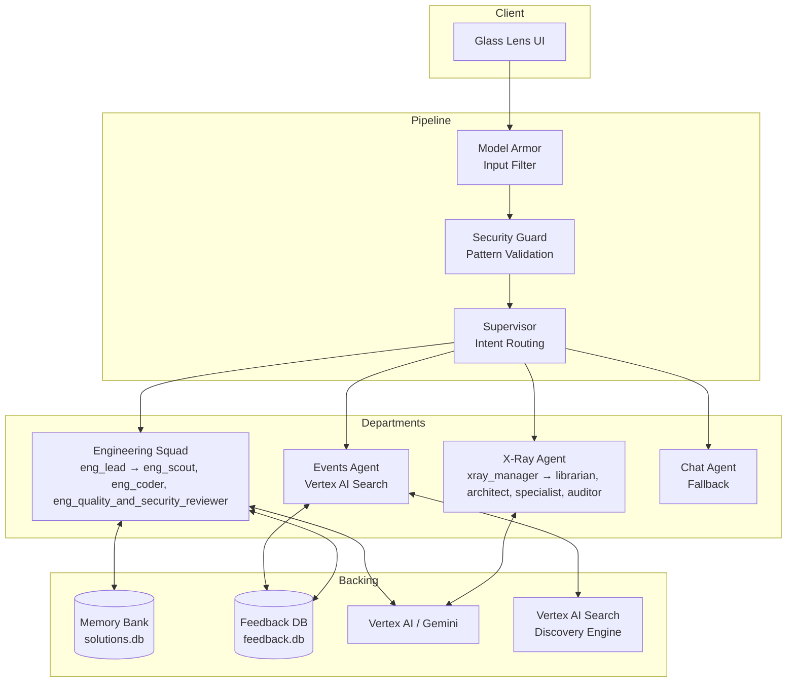
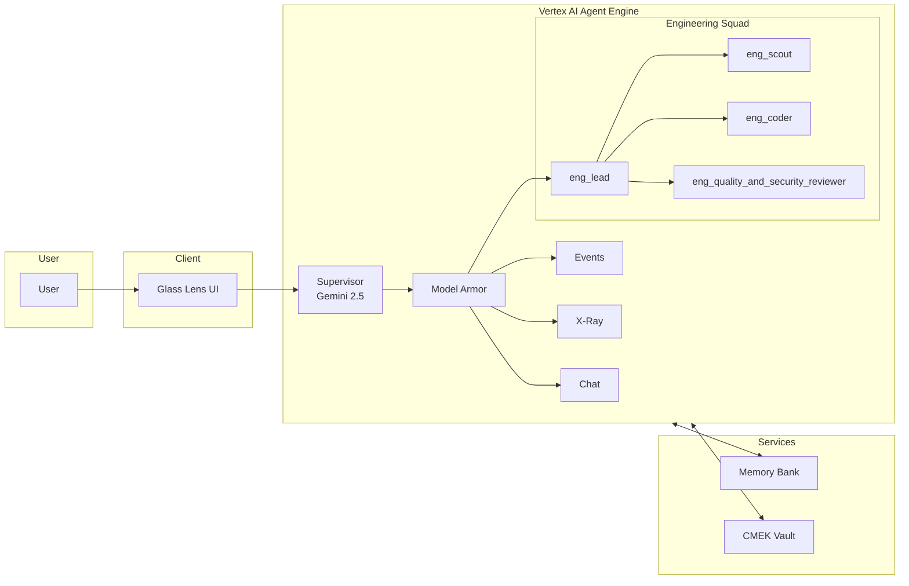

# AI Agentic Lens

A secure, multi-agent cloud architecture for Google Cloud Platform, built on **Google Cloud ADK v1.18**, **Vertex AI**, and a **Supervisor + Specialist** orchestration model. Supports **local/Cloud Run** (Glass Lens UI) and **Vertex AI Agent Engine** deployment modes.

**Primary GCP project for this repo:** `agentic-prismv333` — keep `versions.env`, `.env`, and `gcloud config set project agentic-prismv333` aligned; avoid deploying these scripts into other projects unless you intentionally change `PROJECT_ID`.

---

## Table of Contents

1. [Project Overview](#1-project-overview)
2. [Architecture](#2-architecture)
3. [User Interface (Glass Lens)](#3-user-interface-glass-prism)
4. [Departments](#4-departments)
5. [Workflow](#5-workflow)
6. [Tech Stack & Integrations](#6-tech-stack--integrations)
7. [Repository Layout](#7-repository-layout)
8. [Security Model](#8-security-model)
9. [Quick Start](#9-quick-start) — [Fresh install in a new project](#91-fresh-install-in-a-new-project)
10. [Configuration](#10-configuration)
11. [References](#11-references)
12. [Project File Inventory](#12-project-file-inventory)

---

## 1. Project Overview

**AI Agentic Lens** is an enterprise-grade multi-agent orchestration system that routes user requests through security guardrails and dispatches to specialized departments:

| Component | Role |
|-----------|------|
| **Supervisor** | Central orchestrator that classifies intent, enforces Model Armor, and routes to the right specialist |
| **Specialists** | Engineering (cloud/infra), Events (conferences/schedules), X-Ray (IAM/least-privilege audit), Chat (general fallback) |

### Deployment Modes

| Mode | Entry Point | Backend | Use Case |
|------|-------------|---------|----------|
| **Glass Lens UI** | `agentic-lens/glass_ui/` (React) + `glass_ui_api.py` | `backend/*` or Agent Engine | Cloud Run service `ai-prism-agent-glass-ui`; welcome/telemetry landing, demo scenarios, Model Armor toggle, Live System Logs. Run locally with `uvicorn glass_ui_api:app`. |
| **Agent Engine** | Same UI | Vertex AI Agent Engine | Deployed agents with Agent Identity, CMEK; set `AGENTIC_LENS_SUPERVISOR_ENGINE` for the UI to use the Supervisor engine |

---

## 2. Architecture

### High-Level Flow (Local / Cloud Run Mode)

```
┌──────────────┐    ┌─────────────────────────────┐    ┌──────────────────────────────────────────────┐
│   User       │───▶│  Glass Lens UI             │───▶│  Pipeline: Model Armor → Security Guard       │
│   (Browser)  │    │  (glass_ui_api + glass_ui)  │    │  → Supervisor → Department Agent → Response   │
└──────────────┘    └─────────────────────────────┘    └──────────────────────────────────────────────┘
```

### Detailed Flow Diagram



### Agent Engine Mode (Vertex AI)



---

## 3. User Interface (Glass Lens)

| Stack | Service / Entry | Description |
|-------|-----------------|-------------|
| React, Vite, Tailwind | `agentic-lens/glass_ui/` + `glass_ui_api.py` | React frontend and FastAPI backend; deployed as Cloud Run service **ai-prism-agent-glass-ui** (region e.g. us-central1 or us-west1). Run locally: `uvicorn glass_ui_api:app` then optionally `cd agentic-lens/glass_ui && npm run dev`. |

### Glass Lens – Features

- **Welcome / telemetry landing** – Browser-wide submit-once flow (shared across tabs) with inactivity reset (~30 minutes). Form submit transitions immediately to the UI while telemetry is sent asynchronously via `POST /api/telemetry`.
- **Omnibar** – Glass-style command input with rotating placeholder suggestions and clickable suggestion pills.
- **Demo scenarios** – Preset prompts by category: Security (e.g. jailbreak, PII), Engineering (GKE Autopilot, Python, serverless, Cloud Run vs GKE), X-Ray (IAM for Cloud Run), Events (keynote), Chat (identity, AWS Lambda brand pivot).
- **Model Armor** – Toggle and level (e.g. medium/high) in the UI; backend applies the same Model Armor and Security Guard pipeline.
- **Live System Logs** – Per-session telemetry (Security → Supervisor → Department) with optional Firestore persistence (`GLASS_UI_LOGS_FIRESTORE_DATABASE`) for multi-instance. Logs expand with page content (no fixed-height box).
- **Health** – `GET /healthz` (liveness); `GET /healthz?deep=1` (readiness: project + Supervisor config).

Glass Lens talks to the Python backend via **glass_ui_api.py** (FastAPI): `POST /api/query`, `GET /api/logs`, `GET /api/history`, `POST /api/feedback`, `POST /api/telemetry`. Deploy with `deploy-glass-ui.sh` (sets `GCP_PROJECT_ID`, optional `AGENTIC_LENS_SUPERVISOR_ENGINE`). See `agentic-lens/glass_ui/README.md` and `PRODUCTION_CHECKLIST.md` for env vars and IAM.

---

## 4. Departments

### 4.1 All Departments and Agents (Summary)

All agent and path names use **underscores** (see [CONVENTIONS.md](CONVENTIONS.md)).

| Department | Agents | Role |
|------------|--------|------|
| **Supervisor** | **agentic_lens_supervisor** (orchestrator) | Classifies intent, enforces Model Armor, routes to the correct department |
| **Engineering** | **eng_lead**, **eng_scout**, **eng_coder**, **eng_quality_and_security_reviewer** | eng_lead orchestrates Scout → Coder → Quality and Security Reviewer; Terraform/Python, memory cache |
| **Events** | **events** | Vertex AI Search (Discovery Engine); conferences, schedules, tickets, keynotes |
| **X-Ray** | **xray_manager**, **xray_librarian**, **xray_architect**, **xray_specialist**, **xray_auditor** | IAM audit, least-privilege; manager orchestrates Librarian → Architect → Specialist → Auditor |
| **Chat** | **chat** | Fallback for greetings, general tech, competitor/brand pivot |

### 4.2 Engineering Department

| Agent | Role | Description |
|-------|------|-------------|
| **eng_lead** | Engineering Manager | Orchestrates Scout, Coder, Quality and Security Reviewer |
| **eng_scout** | Architect | Plans infrastructure; uses Vertex AI + Google Search grounding |
| **eng_coder** | Developer | Generates Terraform/Python from Scout plans |
| **eng_quality_and_security_reviewer** | Security Auditor | Validates code against policy; pass/fail and issue list |

**Pipeline:** Scout → Coder → Quality and Security Reviewer (with self-healing retry loop for explicit code requests)

- **Output modes:** Architecture/design questions return explanatory guidance by default; explicit implementation asks return Terraform/Python through the reviewer loop.
- **Memory:** Caches validated solutions in `solutions.db`

### 4.3 Events Department

| Responsibility | Description |
|----------------|-------------|
| **Scope** | Conference, schedule, tickets, pricing, venue, sponsorship, registration |
| **Integration** | Vertex AI Search (Discovery Engine) with GCS data store |
| **Data** | Event documents, FAQs, pricing tiers, session info |

### 4.4 X-Ray Department

| Responsibility | Description |
|----------------|-------------|
| **Scope** | IAM audit, least-privilege analysis, code security review |
| **Workflow** | IDENTIFY → CONTRAST (lazy vs X-Ray way) → PRESCRIBE (custom role commands) |
| **Model** | Gemini 1.5 Flash (X-Ray agents), orchestrated via Vertex AI Agent Engine |

**X-Ray Agent Squad (Agent Engine):**

| Agent | Role | Description |
|-------|------|-------------|
| **xray_manager** | Orchestrator | Entry point for X-Ray; routes work across Librarian → Architect → Specialist → Auditor and returns audited results. |
| **xray_librarian** | Context Retriever | Fetches repo and secret context (e.g., GitHub + Secret Manager) for IAM analysis; read-only. |
| **xray_architect** | State Analyst | Reads current cloud state and maps resources to the permissions they require; read-only. |
| **xray_specialist** | The Learner | Infers IAM policies from code and docs; writes to a Firestore-backed knowledge base for reuse. |
| **xray_auditor** | Independent QA | Validates proposed IAM for existence, relevance, and hallucinations before anything reaches the user. |

### 4.5 Chat Department

| Responsibility | Description |
|----------------|-------------|
| **Scope** | General conversation, greetings, unclear intent |
| **Role** | Fallback when no specialist matches |

### 4.6 Supervisor Routing Priority

The Supervisor uses strict rules to pick the target agent. All agent and path names use **underscores** (see [CONVENTIONS.md](CONVENTIONS.md)).

**A. Competitor check:** If the query mentions AWS, Azure, OpenAI, ChatGPT, etc. → always **Chat** (brand pivot).

**B. Repo tie-breaker:** When the user provides a GitHub repo URL:
- **Deploy/Build** (action) → **Engineering (`eng_lead`)**
- **Analyze/Check/Audit** (info) → **X-Ray (`xray_manager`)**

**C. Semantic priority (nouns > verbs):** If the query has both deployment verbs and security nouns (e.g. "What *permissions* do I need to *deploy*?"), route to **X-Ray** (user wants information, not execution).

**D. Department triggers:**
1. **Engineering** – Deploy, build, write code, Terraform, GKE, Cloud Run, fix errors
2. **Events** – Conference, schedule, ticket, venue, keynote, registration
3. **X-Ray** – Audit, IAM, permissions, least privilege, 403, repo analysis, secrets
4. **Chat** – Greetings, general tech, competitor questions, fallback

---

## 5. Workflow

### Request Lifecycle (Local / Cloud Run)

| Step | Component | Action |
|------|-----------|--------|
| 1 | **Model Armor** | Scan prompt with `security-medium` or `security-high` template; block on MATCH_FOUND; optionally return sanitized prompt (DLP de-identification) |
| 2 | **Security Guard** | Pattern-based validation; block `hack`, `ignore`, `bypass` |
| 3 | **Supervisor** | Classify intent; route to Engineering, Events, X-Ray, or Chat |
| 4 | **Department Agent** | Execute specialist logic (Engineering pipeline, Events search, X-Ray audit, or Chat) |
| 5 | **Response** | Return to UI with citations (Events) and execution logs |

### Engineering Pipeline (Scout → Coder → Quality and Security Reviewer)

| Step | Agent | Action |
|------|-------|--------|
| 1 | **Scout** | Analyze request with Gemini + Google Search grounding; determine output type (Terraform, Python, architectural explanation) |
| 2 | **Coder** | Generate code or explanation |
| 3 | **Quality and Security Reviewer** | Validate output security/scope and output-type alignment; if BLOCKED, retry Coder with feedback (max 3 attempts) |
| 4 | **Memory** | Save validated solutions to `solutions.db` for cache hits |

### Feedback Loop

- **Routing feedback:** Correct misrouted queries (user_query, routed_to, should_route_to)
- **Response feedback:** Quality ratings (thumbs up/down, issue type)
- **Training examples:** Curated examples per department (admin-approved)
- **Supervisor Trainer:** Uses approved feedback to improve routing

The feedback loop is persisted in `feedback.db` and driven by `backend/feedback.py`, `backend/feedback_ui.py`, and `backend/supervisor_trainer.py`. See `FEEDBACK_SYSTEM.md` for end-to-end details and data schemas.

---

## 6. Tech Stack & Integrations

### Core Technologies

| Category | Technology |
|----------|------------|
| **UI** | React, Vite, Tailwind CSS (Glass Lens); backend API: FastAPI (`glass_ui_api.py`) |
| **Language** | Python 3.10+ |
| **Orchestration** | Custom pipeline (client app) or ADK 1.18 (Agent Engine) |
| **LLMs** | Vertex AI Gemini (2.0 Flash, 2.5 Pro, 1.5 Flash) |

### Google Cloud Integrations

| Service | Purpose |
|---------|---------|
| **Vertex AI** | Generative models (Gemini) |
| **Vertex AI Search (Discovery Engine)** | Events knowledge base (Engine/Data Store) |
| **Model Armor** | Input/output filtering, policy enforcement (security-medium, security-high) |
| **Cloud DLP** | Sensitive data de-identification (High+DLP template) |
| **Cloud KMS** | CMEK for data at rest (Agent Engine) |
| **Secret Manager** | Secrets (project ID, data store ID, etc.) |
| **Cloud Run** | Container hosting for Glass Lens UI (`ai-prism-agent-glass-ui`) |

### Local Dependencies

| Component | Storage |
|-----------|---------|
| **Memory** | SQLite (`solutions.db`) – cached validated solutions |
| **Feedback** | SQLite (`feedback.db`) – routing, response quality, training examples |

### Key Python Packages

```
google-cloud-aiplatform>=1.38.0
google-cloud-dlp>=3.12.0
google-cloud-modelarmor>=0.3.0
google-cloud-discoveryengine>=0.11.0
google-cloud-secret-manager>=2.16.0
python-dotenv
fastapi
uvicorn[standard]
```

---

## 7. Repository Layout

```
.
├── versions.env                # PROJECT_ID, REGION, ADK_VERSION, MODEL_VERSION, CMEK keys
├── env.example                 # Template for .env (GCP_PROJECT_ID, VERTEX_SEARCH_*, etc.)
├── requirements.txt            # Python dependencies (root / local)
├── deploy.sh                   # Deploy all agents to Vertex AI Agent Engine (from repo root)
├── deploy_all.sh               # One-shot: infra + agents; set PROJECT_ID, REGION, MODEL_VERSION in versions.env and run
├── setup_infra.sh              # Legacy: APIs, KMS, Model Armor, X-Ray secret/IAM (use infra/apply.sh for full flow)
├── infra/
│   ├── apply.sh                # Consolidated infra: run all steps (01–12; step 12 = VPC-SC perimeter; set VPC_SC_ALLOWED_USER_EMAIL or VPC_SC_ALLOWED_MEMBERS)
│   └── steps/                  # 01_enable_apis … 10_setup_kb (optional), 11_patch_adk, 12_vpc_sc
├── deploy-glass-ui.sh          # Deploy Glass Lens UI to Cloud Run (ai-prism-agent-glass-ui)
├── glass_ui_api.py             # FastAPI backend for UI: /api/query, /api/logs, /api/telemetry, /healthz
├── Dockerfile_glass_ui         # Container for Glass UI API + static frontend
├── cloudbuild_glass_ui.yaml    # Cloud Build config for UI image
│
├── backend/                    # Core logic (Local Mode)
│   ├── supervisor.py           # Supervisor routing logic
│   ├── engineering.py         # Scout → Coder → Quality and Security Reviewer pipeline
│   ├── events.py               # Events agent (Vertex AI Search)
│   ├── xray.py                 # X-Ray IAM auditor
│   ├── model_armor.py          # Model Armor prompt scanning
│   ├── guard.py                # Security Guard pattern validation
│   ├── memory.py               # solutions.db cache
│   ├── feedback.py             # feedback.db, training examples
│   ├── supervisor_trainer.py   # Learned patterns from feedback
│   ├── agent_engine_client.py  # Client for Vertex AI Agent Engine Supervisor
│   ├── utils.py                # Shared backend utilities
│   ├── secrets.py              # Secret Manager helpers
│   └── setup_kb.py             # Vertex AI Search data store setup
│
├── agentic-lens/              # ADK / Agent Engine deployment (current)
│   ├── adk.yaml                # ADK spec (agents, runtime, identity mode)
│   ├── agents/                 # All agent folders use underscores (CONVENTIONS.md)
│   │   ├── supervisor/         # Orchestrator + Model Armor gate (agentic_lens_supervisor)
│   │   ├── eng_lead/           # Engineering Manager — orchestrates Scout, Coder, Quality and Security Reviewer
│   │   ├── eng_scout/          # Architect
│   │   ├── eng_coder/          # Developer
│   │   ├── eng_quality_and_security_reviewer/       # Security Auditor
│   │   ├── xray_manager/       # X-Ray department head
│   │   ├── xray_librarian/     # Repo/context librarian
│   │   ├── xray_architect/     # IAM/infrastructure planner
│   │   ├── xray_specialist/    # Terraform / implementation specialist
│   │   ├── xray_auditor/       # Compliance & least-privilege auditor
│   │   ├── events/             # Events specialist
│   │   └── chat/               # Fallback chat
│   ├── glass_ui/               # Glass Lens UI (React + Vite + Tailwind); served with glass_ui_api
│   │   ├── src/                # React app (LandingPage, Omnibar, demo scenarios, Live Logs)
│   │   ├── package.json
│   │   └── README.md
│   ├── security/               # CMEK, Model Armor policies, IAM
│   │   ├── kms.tf
│   │   ├── policies/
│   │   └── iam/
│   └── DEPLOY.md               # Full deploy, CMEK, troubleshooting
│
├── scripts/                    # Deploy helpers, cleanup, diagnostics
│   ├── get_agent_engine_id.py  # Get Supervisor (or other) engine ID for client
│   ├── list_existing_agent_engines.py
│   ├── cleanup_reasoning_engines.py
│   ├── fetch_deploy_errors.sh
│   ├── diagnose_deploy.py
│   ├── simulate_agent_startup.py
│   └── ...
│
├── tests/
│   ├── __init__.py
│   └── test_supervisor_routing.py
│
├── CONVENTIONS.md              # Naming: underscores for agents/paths
├── FEEDBACK_SYSTEM.md          # Feedback & training system
├── PROD_UI.md                  # Production UI hosting
├── LOCAL_SETUP.md              # Local development setup
└── README_v3.md                # This file
```

---

## 8. Security Model

| Pillar | Description |
|--------|-------------|
| **Model Armor** | Input/output filtering via templates (`security-medium`, `security-high`); blocks jailbreak, RAI violations, malicious URIs, SDP; DLP de-identification for High+DLP |
| **Security Guard** | Pattern-based validation (hack, ignore, bypass) before Supervisor; enforces simple guardrails even if Model Armor is disabled |
| **Agent Identity** | Agent Engine mode: managed identity, no service account keys; IAM scoped per-agent via Terraform |
| **CMEK** | Customer-managed encryption keys (Agent Engine, Terraform) for data at rest |
| **IAM** | Least-privilege roles; agent permissions and identities managed under `agentic-lens/security/iam/` |

**Interaction example (local / Cloud Run):**

1. A user prompt enters the **Glass Lens UI**, then flows through **Model Armor** (policy templates).
2. If Model Armor returns `MATCH_FOUND`, the request is **blocked or sanitized** before any model call.
3. The **Security Guard** then enforces pattern-based rules (e.g., `hack`, `ignore`, `bypass`), blocking unsafe prompts even when Model Armor is permissive.
4. Only after both layers pass does the **Supervisor** route to Engineering, Events, X-Ray, or Chat.

For a deeper dive into IAM roles, CMEK, and agent identities, see `agentic-lens/security/` and `agentic-lens/AGENTIC_LENS_COMPLIANCE.md`.

---

## 9. Quick Start

**Quick deploy:** Set `PROJECT_ID`, `REGION`, and `MODEL_VERSION` in `versions.env`, then run `./deploy_all.sh` to deploy infrastructure and agents and auto-populate `.env` (Supervisor engine, project number). For a **new project**, run `./scripts/clean_for_fresh_install.sh` first. See [DEPLOY_GUIDE_agentic-prismv333.md](DEPLOY_GUIDE_agentic-prismv333.md).

### 9.1 Fresh install in a new project

Use this when you have **copied the project to a new folder** (or cloned the repo) and want to run a **full install in a new GCP project** from scratch.

**Prerequisites**

- A **new GCP project** (create in [Cloud Console](https://console.cloud.google.com) or `gcloud projects create ...`).
- **gcloud CLI** installed and authenticated:  
  `gcloud auth login` and `gcloud auth application-default login`.
- **Python 3.10+** (for root and for `agentic-lens/.venv`).

**Steps (in order)**

| Step | Action |
|------|--------|
| **1. Copy the repo** | Copy or clone the project into a new folder. **Do not** copy from the old project: `.env`, `.venv/`, `agentic-lens/.venv/`, `*.db`, `.terraform/`, or Terraform state files. See [Transfer checklist](#1212-summary-transfer-checklist). |
| **2. Configure for the new project** | **versions.env:** Set `PROJECT_ID` (new project ID), `REGION` (e.g. `us-west1`), `MODEL_VERSION` (e.g. `gemini-2.5-pro`). Optionally set `ORG_ID` (required for IAM and VPC-SC; can be auto-resolved from project parent). For VPC-SC (step 12): set `VPC_SC_ALLOWED_USER_EMAIL` or `VPC_SC_ALLOWED_MEMBERS` when running apply, or you will be prompted. |
| | **.env:** Copy `env.example` to `.env`. Set `GCP_PROJECT_ID`, `GCP_PROJECT_NUMBER` (from Cloud Console or `gcloud projects describe PROJECT_ID --format='value(projectNumber)'`), `GCP_LOCATION`. Leave `VERTEX_SEARCH_DATA_STORE_ID` empty until after step 4 if you run setup_kb. |
| **3. Create virtual environments** | From repo root: `python3 -m venv .venv && .venv/bin/pip install -r requirements.txt`  
  Then: `cd agentic-lens && python3 -m venv .venv && .venv/bin/pip install -r requirements.txt && cd ..` |
| **4. Run infrastructure** | From repo root: `./infra/apply.sh`  
  - When **step 05 (CMEK)** runs, it prints `AGENT_ENGINE_KMS_KEY_*` lines — **add them to versions.env**.  
  - Optional: `RUN_TELEMETRY=1 RUN_SETUP_KB=1 ./infra/apply.sh` to add telemetry and the Events data store. If you ran setup_kb, copy `VERTEX_SEARCH_DATA_STORE_ID` from the script output into `.env`. |
| **5. Deploy agents** | From repo root: `./deploy.sh`  
  Note the **Supervisor engine** resource name from the output, or run:  
  `agentic-lens/.venv/bin/python scripts/get_agent_engine_id.py supervisor` |
| **6. Point the UI at the Supervisor** | Add to `.env`:  
  `AGENTIC_LENS_SUPERVISOR_ENGINE=projects/<PROJECT_ID>/locations/<REGION>/reasoningEngines/<id>`  
  Or set that env var before deploying the Glass UI (step 7). |
| **7. Deploy Glass Lens UI (optional)** | `export GCP_PROJECT_ID=<your-project>` (and optionally `REGION=us-west1`), then `./deploy-glass-ui.sh`. |
| **8. After first deploy (if needed)** | If you see service usage or Cloud Trace errors:  
  `./scripts/grant_service_usage_to_engines.sh` |

**Summary one-liner (after steps 1–3):**

```bash
./infra/apply.sh && \
# Add AGENT_ENGINE_KMS_KEY_* to versions.env, then:
./deploy.sh && \
# Add AGENTIC_LENS_SUPERVISOR_ENGINE to .env, then:
./deploy-glass-ui.sh
```

For local-only (no deploy): after step 3, copy `env.example` to `.env`, set `GCP_PROJECT_ID` and `GCP_LOCATION`, then `uvicorn glass_ui_api:app` (see [Local / Cloud Run Mode](#local--cloud-run-mode)).

---

### Local / Cloud Run Mode

```bash
# 1. Configure
cp env.example .env
# Edit .env: GCP_PROJECT_ID, GCP_PROJECT_NUMBER, GCP_LOCATION, VERTEX_SEARCH_DATA_STORE_ID

# 2. Install (from repo root)
pip install -r requirements.txt

# 3. Run Glass Lens API locally (from repo root)
uvicorn glass_ui_api:app --host 0.0.0.0 --port 8080
# Optional: run frontend dev server: cd agentic-lens/glass_ui && npm run dev
# Open http://localhost:8080 (API serves built frontend when deployed; for local dev you may run API + frontend separately)
```

If agents are not deployed yet, the UI can still run with local backend pipelines. To use deployed Agent Engine agents, set `AGENTIC_LENS_SUPERVISOR_ENGINE` in `.env` (see Configuration).

### Agent Engine Mode (Vertex AI)

See **agentic-lens/DEPLOY.md** for full steps, CMEK, and troubleshooting.

```bash
# 1. Configure versions.env
# Set PROJECT_ID, REGION, MODEL_VERSION. Optionally set per-department CMEK keys.

# 2. Provision infrastructure (recommended: single script)
./infra/apply.sh
# Optional: RUN_TELEMETRY=1 RUN_SETUP_KB=1 ./infra/apply.sh
# Legacy: ./setup_infra.sh (partial; then run IAM and Firestore Terraform manually)

# 3. Deploy all agents
./deploy.sh
# Or specific agents: ./deploy.sh supervisor eng_lead eng_scout eng_coder eng_quality_and_security_reviewer xray_manager ...

# 4. Set Supervisor engine for client (get ID from deploy output or scripts/get_agent_engine_id.py supervisor)
export AGENTIC_LENS_SUPERVISOR_ENGINE=projects/<PROJECT_ID>/locations/<REGION>/reasoningEngines/<id>

# 5. Run Glass Lens UI (deploy with deploy-glass-ui.sh or run API locally: uvicorn glass_ui_api:app)
```

### Glass Lens UI (deploy to Cloud Run)

```bash
# 1. Set project (and optional region; default us-central1)
export GCP_PROJECT_ID=your-project-id
export REGION=us-west1   # optional

# 2. Optional: set Supervisor engine for the UI
export AGENTIC_LENS_SUPERVISOR_ENGINE=projects/.../locations/.../reasoningEngines/<id>

# 3. Deploy (builds with cloudbuild_glass_ui.yaml, deploys ai-prism-agent-glass-ui)
./deploy-glass-ui.sh
```

See `PRODUCTION_CHECKLIST.md` for env vars (e.g. `GLASS_UI_LOGS_FIRESTORE_DATABASE` for persistent logs).

### Docker (Local, optional)

For a containerized local run, see `extra/scripts/docker-compose.yml` (optional). Standard local run: `uvicorn glass_ui_api:app`.

### Developer Workflow & Tests

- **Recommended loop:**
  1. Create `.env` from `env.example` and fill in GCP project, region, and Vertex AI Search IDs.
  2. Install dependencies and run the API via `uvicorn glass_ui_api:app` or deploy with `./deploy-glass-ui.sh`.
  3. Modify backend in `backend/` or ADK agents under `agentic-lens/agents/`.

**Local integration (before rollout):**

```bash
pip install -r requirements-dev.txt   # pytest
make test-integration                 # or: PYTHONPATH=. python -m pytest tests/
# If pytest is only in a venv: make test-integration PY=./agentic-lens/.venv/bin/python
```

Tests live under `tests/` and load shared prompts from `tests/fixtures/department_scenarios.json`.

**Live E2E (deployed Glass UI, IAP):** after `pytest` passes, run:

```bash
export IAP_OAUTH_CLIENT_ID='YOUR_IAP_OAUTH_CLIENT_ID.apps.googleusercontent.com'
export GLASS_UI_URL='https://your-glass-ui-url'   # optional
python3 scripts/smoke_glass_ui_departments.py --profile full --report /tmp/e2e-report.json
# Quick post-deploy:  --profile smoke
# Optional: --strict-department  --retries 2  --report-full-answers (PII risk)
```

See the script docstring for `LIVE_E2E_QUERY_TIMEOUT_S`, troubleshooting (`lens_request_id`, `execution_log`), and report redaction defaults.

---

## 10. Configuration

### Environment Variables (see env.example)

**Core (required for client):**

| Variable | Required | Description |
|----------|----------|-------------|
| `GCP_PROJECT_ID` | Yes | Google Cloud project ID |
| `GCP_PROJECT_NUMBER` | Yes | Numeric project number (Discovery Engine path) |
| `GCP_LOCATION` | Yes | Region (e.g. us-west1) |
| `VERTEX_SEARCH_DATA_STORE_ID` | Yes | Events data store ID |
| `VERTEX_SEARCH_ENGINE_ID` | No | Engine ID (Vertex AI Search Enterprise Edition only) |

**Agent Engine (when using deployed agents):**

| Variable | Description |
|----------|-------------|
| `AGENTIC_LENS_SUPERVISOR_ENGINE` | Full resource name of Supervisor Reasoning Engine (e.g. `projects/.../locations/us-west1/reasoningEngines/<id>`). Get from deploy output or `scripts/get_agent_engine_id.py supervisor`. |
| `AGENTIC_LENS_ENGINE_SCOUT`, `AGENTIC_LENS_ENGINE_CODER`, `AGENTIC_LENS_ENGINE_QUALITY_AND_SECURITY_REVIEWER` | For **eng_lead** (Engineering Squad): engine resource names for Scout, Coder, and Quality and Security Reviewer. See agentic-lens/DEPLOY.md. |

**Optional:** `GITHUB_PAT` (fallback if Secret Manager not used); `SKIP_MODEL_ARMOR`, `MODEL_ARMOR_TIMEOUT` for local testing.

### Model Armor Templates

- **security-medium:** Standard filtering (jailbreak, RAI, malicious URI)
- **security-high:** Same + DLP-based sensitive data de-identification

Templates are provisioned via Terraform in `agentic-lens/security/policies/`.

### Naming convention

Agent names and paths use **underscores** (e.g. `eng_lead`, `xray_manager`). See [CONVENTIONS.md](CONVENTIONS.md).

---

## 11. References

- **In-repo:** [CONVENTIONS.md](CONVENTIONS.md) (naming: underscores for agents/paths), [agentic-lens/DEPLOY.md](agentic-lens/DEPLOY.md) (deploy, CMEK, troubleshooting).
- [Vertex AI Agent Engine](https://cloud.google.com/vertex-ai/generative-ai/docs/agent-engine/overview)
- [Google Cloud ADK](https://github.com/google/adk)
- [Model Armor](https://cloud.google.com/model-armor/docs)
- [Vertex AI Search (Discovery Engine)](https://cloud.google.com/generative-ai-app-builder/docs/introduction)
- [Agent Builder locations](https://docs.cloud.google.com/agent-builder/locations)

---

## Related Documentation

| Document | Description |
|----------|-------------|
| [README.md](README.md) | Project blueprint (routing, departments) |
| [CONVENTIONS.md](CONVENTIONS.md) | Naming: underscores for agents/paths |
| [agentic-lens/DEPLOY.md](agentic-lens/DEPLOY.md) | Deploy, CMEK, troubleshooting |
| [FEEDBACK_SYSTEM.md](FEEDBACK_SYSTEM.md) | Feedback & training system |
| [PRODUCTION_CHECKLIST.md](PRODUCTION_CHECKLIST.md) | Glass UI & Agent Engine production checklist |
| [agentic-lens/glass_ui/README.md](agentic-lens/glass_ui/README.md) | Glass Lens UI (Tailwind, Omnibar, API contract) |
| [LOCAL_SETUP.md](LOCAL_SETUP.md) | Local development setup |
| [SUPERVISOR_AUDIT.md](SUPERVISOR_AUDIT.md) | Supervisor routing audit |

---

## 12. Project File Inventory

This section catalogs all files in the project to help identify what to transfer to the next iteration. Files are categorized as **Active (Used)**, **Legacy/Unused**, or **Generated/Runtime (Exclude from Transfer)**.

### 12.1 Core Application Files (Active - Transfer)

| Path | Role |
|------|------|
| `agentic-lens/glass_ui/` | Glass Lens UI (React + Vite + Tailwind); built and served with `glass_ui_api.py` |
| `glass_ui_api.py` | FastAPI backend for UI: `/api/query`, `/api/logs`, `/api/history`, `/api/feedback`, `/api/telemetry`, `/healthz` |
| `deploy-glass-ui.sh` | Deploy Glass Lens UI to Cloud Run service `ai-prism-agent-glass-ui` |
| `Dockerfile_glass_ui` | Container for UI (API + static frontend) |
| `cloudbuild_glass_ui.yaml` | Cloud Build config for UI image |
| `requirements.txt` | Python dependencies for root/local use |
| `versions.env` | Project-wide ADK configuration (PROJECT_ID, REGION, ADK_VERSION, MODEL_VERSION, CMEK keys) |
| `env.example` | Template for `.env` (GCP config, Vertex Search IDs, optional AGENTIC_LENS_SUPERVISOR_ENGINE) |
| `deploy.sh` | Deploy all (or selected) ADK agents to Vertex AI Agent Engine |
| `infra/apply.sh` | Consolidated infra (APIs, bootstrap, Model Armor, CMEK, IAM, Firestore, Artifact Registry; optional telemetry, setup_kb) |
| `setup_infra.sh` | Legacy: partial infra (APIs, KMS, Model Armor, X-Ray); prefer `infra/apply.sh` |
| `.cursor/rules/naming.mdc` | Cursor IDE naming convention (underscores) |

### 12.2 Backend Modules (Active - Transfer)

| Path | Role |
|------|------|
| `backend/__init__.py` | Backend package initialization |
| `backend/supervisor.py` | Supervisor routing logic (classifies intent, routes to departments) |
| `backend/engineering.py` | Engineering pipeline (Scout → Coder → Quality and Security Reviewer) |
| `backend/events.py` | Events agent (Vertex AI Search integration) |
| `backend/xray.py` | X-Ray IAM auditor (local mode) |
| `backend/model_armor.py` | Model Armor prompt scanning and filtering |
| `backend/guard.py` | Security Guard pattern-based validation |
| `backend/memory.py` | Solutions cache (`solutions.db` management) |
| `backend/feedback.py` | Feedback database (`feedback.db`) and training examples |
| `backend/feedback.py` | Feedback DB and training examples (used by glass_ui_api) |
| `backend/supervisor_trainer.py` | Learned patterns from feedback for routing improvement |
| `backend/supervisor_training_examples.py` | Curated training examples for supervisor |
| `backend/agent_engine_client.py` | Client for Vertex AI Agent Engine Supervisor |
| `backend/utils.py` | Shared backend utilities |
| `backend/secrets.py` | Secret Manager helpers |
| `backend/setup_kb.py` | Vertex AI Search data store setup script |

### 12.3 ADK Agent Definitions (Active - Transfer)

**Supervisor:**
- `agentic-lens/agents/supervisor/agent.py` - Supervisor agent entry point
- `agentic-lens/agents/supervisor/agent.yaml` - Deployment metadata
- `agentic-lens/agents/supervisor/root_agent.yaml` - ADK agent configuration
- `agentic-lens/agents/supervisor/requirements.txt` - Agent dependencies
- `agentic-lens/agents/supervisor/src/__init__.py` - Package initialization
- `agentic-lens/agents/supervisor/src/router.py` - Router logic
- `agentic-lens/agents/supervisor/src/model_armor_client.py` - Model Armor client

**Engineering Squad:**
- `agentic-lens/agents/eng_lead/agent.py`, `agent.yaml`, `requirements.txt` (instruction in agent.py)
- `agentic-lens/agents/eng_lead/src/manager.py`, `src/__init__.py`
- `agentic-lens/agents/eng_scout/agent.py`, `agent.yaml`, `config.yaml`, `requirements.txt`
- `agentic-lens/agents/eng_coder/agent.py`, `agent.yaml`, `root_agent.yaml`, `requirements.txt`
- `agentic-lens/agents/eng_quality_and_security_reviewer/agent.py`, `agent.yaml`, `root_agent.yaml`, `requirements.txt`

**X-Ray Department:**
- `agentic-lens/agents/xray_manager/agent.py`, `agent.yaml`, `root_agent.yaml`, `requirements.txt`
- `agentic-lens/agents/xray_manager/src/manager.py`, `src/__init__.py`
- `agentic-lens/agents/xray_librarian/agent.py`, `agent.yaml`, `root_agent.yaml`, `requirements.txt`
- `agentic-lens/agents/xray_librarian/src/librarian.py`, `src/github_tools.py`, `src/__init__.py`
- `agentic-lens/agents/xray_architect/agent.py`, `agent.yaml`, `root_agent.yaml`, `requirements.txt`
- `agentic-lens/agents/xray_architect/src/__init__.py`
- `agentic-lens/agents/xray_specialist/agent.py`, `agent.yaml`, `root_agent.yaml`, `requirements.txt`
- `agentic-lens/agents/xray_specialist/src/tools.py`, `src/kb_tools.py`, `src/__init__.py`
- `agentic-lens/agents/xray_auditor/agent.py`, `agent.yaml`, `root_agent.yaml`, `requirements.txt`
- `agentic-lens/agents/xray_auditor/src/kb_tools.py`, `src/__init__.py`
- `old_files/agents/xray/README.md` - Legacy X-Ray department documentation
- `old_files/agents/xray/` - Legacy X-Ray agent (replaced by xray_manager, xray_librarian, etc.)

**Events Department:**
- `agentic-lens/agents/events/agent.py`, `agent.yaml`, `root_agent.yaml`, `requirements.txt`
- `agentic-lens/agents/events/src/tools.py`, `src/__init__.py`

**Chat Department:**
- `agentic-lens/agents/chat/agent.py`, `agent.yaml`, `root_agent.yaml`, `requirements.txt`
- `agentic-lens/agents/chat/src/chat.py`, `src/stateless_agent.py`, `src/tools.py`, `src/__init__.py`

**Agent Engine Config Files:**
- `agentic-lens/agents/*/.agent_engine_config.json` - Agent Engine metadata (auto-generated, can be regenerated)

**Placeholder Files:**
- `agentic-lens/security/policies/.gitkeep` - Keeps policies directory in git
- `agentic-lens/security/iam/.gitkeep` - Keeps IAM directory in git

### 12.4 ADK Configuration & Client (Active - Transfer)

| Path | Role |
|------|------|
| `agentic-lens/adk.yaml` | ADK project specification (agents, runtime, identity mode) |
| `agentic-lens/engine/session_config.yaml` | Agent Engine session configuration |
| `scripts/seed_events.py` | Events training examples seeding (feedback.db) |

### 12.5 Infrastructure & Terraform (Active - Transfer)

| Path | Role |
|------|------|
| `agentic-lens/security/kms.tf` | Cloud KMS (CMEK) configuration |
| `agentic-lens/security/db/firestore.tf` | Firestore database configuration |
| `agentic-lens/security/db/variables.tf` | Firestore Terraform variables |
| `agentic-lens/security/policies/model_armor.tf` | Model Armor policy templates |
| `agentic-lens/security/policies/README.md` | Model Armor policies documentation |
| `agentic-lens/security/iam/agent_permissions.tf` | Agent IAM bindings and roles |
| `agentic-lens/security/iam/variables.tf` | IAM Terraform variables |
| `agentic-lens/security/iam/terraform.tfvars` | IAM variable values (may contain secrets) |
| `agentic-lens/security/iam/terraform.tfvars.example` | IAM variables template |
| `agentic-lens/security/iam/README.md` | IAM documentation |
| `agentic-lens/security/iam/IDENTITY_VERIFICATION.md` | Identity verification guide |
| `agentic-lens/security/iam/xray_permissions.tf` | X-Ray-specific IAM permissions |
| `agentic-lens/security/vpc_sc/` | VPC Service Controls (Access Context Manager policy, access level, perimeter) |

### 12.6 Deployment & Setup Scripts (Active - Transfer)

| Path | Role |
|------|------|
| `infra/apply.sh` | Consolidated infra (steps 01–12); prefer over setup_infra.sh |
| `setup_infra.sh` | Legacy partial infra; use infra/apply.sh for full flow |
| `deploy.sh` | Deploy all or selected ADK agents to Vertex AI Agent Engine (from repo root) |
| `deploy-glass-ui.sh` | Deploy Glass Lens UI to Cloud Run (`ai-prism-agent-glass-ui`) |

### 12.7 Utility Scripts (Active - Transfer)

| Path | Role |
|------|------|
| `scripts/get_agent_engine_id.py` | Get Supervisor (or other) engine ID for client env (e.g. `AGENTIC_LENS_SUPERVISOR_ENGINE`) |
| `scripts/list_existing_agent_engines.py` | List existing Agent Engines |
| `scripts/cleanup_reasoning_engines.py` | Clean up duplicate Reasoning Engines (see agentic-lens/DEPLOY.md) |
| `scripts/fetch_deploy_errors.sh` | Fetch deployment errors from logs |
| `scripts/diagnose_deploy.py` | Diagnose deployment issues |
| `scripts/simulate_agent_startup.py` | Simulate Agent Engine container startup |
| `scripts/deploy_with_debug.sh` | Deploy single agent with debug output |
| `scripts/fetch_session_403_principal.py` | Debug 403 session errors |
| `scripts/test_local_flow.py` | Test local flow |
| (Other scripts in `scripts/` as needed) | Various diagnostics, IAM, audit logs |

### 12.8 Tests (Active - Transfer)

| Path | Role |
|------|------|
| `tests/__init__.py` | Test package initialization |
| `tests/test_supervisor_routing.py` | Supervisor routing tests |

### 12.9 Documentation (Active - Transfer)

| Path | Role |
|------|------|
| `README_v3.md` | Main project documentation (this file) |
| `README.md` | Project blueprint (routing, departments, single source of truth) |
| `CONVENTIONS.md` | Naming: underscores for agents/paths |
| `SUPERVISOR_AUDIT.md` | Supervisor routing audit (current state, rules) |
| `agentic-lens/DEPLOY.md` | Deploy, CMEK, troubleshooting |
| `DEPLOYMENT.md` | Cloud Run deployment guide |
| `DEPLOYMENT_FIX.md` | Deployment fixes and troubleshooting |
| `FEEDBACK_SYSTEM.md` | Feedback and training system documentation |
| `PRODUCTION_READINESS.md` | Production readiness checklist |
| `PROD_UI.md` | Production UI hosting guide |
| `LOCAL_SETUP.md` | Local development setup |
| `DOCKER_SETUP.md` | Docker setup guide |
| `GOOGLE_SEARCH_SETUP.md` | Google Search grounding setup |
| `SECRET_MANAGER_SETUP.md` | Secret Manager configuration |
| `TEST_UI.md` | UI testing and troubleshooting |
| `CONVENTIONS.md` | Project conventions and naming standards |
| `agentic-lens/ENABLE_APIS.md` | API enablement guide |
| `agentic-lens/AGENTIC_LENS_COMPLIANCE.md` | Compliance posture and controls |
| `agentic-lens/MIGRATE_REGION.md` | Region migration guidance |
| `agentic-lens/DEPLOY.md` | Deployment guide |
| `agentic-lens/security/policies/README.md` | Model Armor policies README |
| `agentic-lens/security/iam/README.md` | IAM README |
| `agentic-lens/security/iam/IDENTITY_VERIFICATION.md` | Identity verification guide |
| `terraform/README.md` | Terraform documentation |
| `docs/SESSION_403_INVESTIGATION.md` | Session 403 investigation notes |
| `docs/FEEDBACK_FLOW_AUDIT.md` | Feedback flow audit |
| `docs/DEPLOYMENT_DUPLICATES.md` | Deployment duplicates analysis |

### 12.10 Legacy/Unused Files (Do NOT Transfer)

**Legacy files (moved to `old_files/`; see `old_files/README.md`):**
- `old_files/prism-adk-2026/` - Legacy ADK configuration (adk.yaml, agents, security, engine)
- `old_files/agents/engineering-lead/*` - Replaced by `eng_lead`
- `old_files/agents/engineering-scout/*` - Replaced by `eng_scout`
- `old_files/agents/engineering-coder/*` - Replaced by `eng_coder`
- `old_files/agents/engineering-sentinel/*` - Replaced by `eng_quality_and_security_reviewer`
- `old_files/agents/xray/*` - Replaced by xray_manager, xray_librarian, etc.

**Legacy Documentation:**
- `README_v2.md` - Old README version
- `README_FEEDBACK.md` - Merged into FEEDBACK_SYSTEM.md
- `README_CURRENT_STATE.md` - Temporary state documentation

**Standalone Test/Debug Scripts (Root Level - May Be Temporary):**
- `test_xray.py` - Standalone X-Ray test
- `test_local_router.py` - Local router test
- `test_fallback.py` - Fallback test
- `test_subagent_resolution.py` - Subagent resolution test
- `verify_*.py` - Various verification scripts (verify_eng_lead.py, verify_chat_response.py, etc.)
- `debug_*.py` - Debug scripts (debug_orchestration.py, debug_agent_connection.py)
- `list_*.py` - List scripts (list_engines.py, list_all_engines_debug.py)
- `manage_gcp.py` - GCP management script (may be unused)
- `create_model_armor_templates.py` - Model Armor template creation (may be superseded)
- `seed_training_data.py` - Training data seeding (may be superseded by admin_feedback.py)
- `admin_feedback.py` - Admin feedback tool (may be unused)

### 12.11 Generated/Runtime Files (Exclude from Transfer)

| Path | Role | Action |
|------|------|--------|
| `.env` | Local environment variables (contains secrets) | **DO NOT TRANSFER** - Regenerate from `env.example` |
| `feedback.db` | Feedback SQLite database (runtime) | **DO NOT TRANSFER** - Will be recreated |
| `solutions.db` | Solutions cache SQLite database (runtime) | **DO NOT TRANSFER** - Will be recreated |
| `*.db-journal` | SQLite journal files | **DO NOT TRANSFER** |
| `schema_full.txt` | Generated schema dump | **DO NOT TRANSFER** |
| `identities_full.txt` | Generated identities dump | **DO NOT TRANSFER** |
| `.venv/` | Python virtual environment | **DO NOT TRANSFER** - Recreate with `pip install -r requirements.txt` |
| `agentic-lens/.venv/` | ADK virtual environment | **DO NOT TRANSFER** - Recreate with `pip install -r requirements.txt` in agentic-lens |
| `agentic-lens/security/**/.terraform/` | Terraform state directories | **DO NOT TRANSFER** - Terraform will recreate |
| `agentic-lens/security/**/.terraform.lock.hcl` | Terraform lock files | **DO NOT TRANSFER** - Terraform will recreate |
| `agentic-lens/agents/*/.agent_engine_config.json` | Auto-generated Agent Engine configs | **OPTIONAL** - Can be regenerated |

### 12.12 Summary: Transfer Checklist

**✅ Transfer These:**
- All files in `backend/` (except `__pycache__/`)
- All files in `agentic-lens/agents/` (except `.venv/` and `.agent_engine_config.json` if regeneratable)
- All files in `agentic-lens/glass_ui/` (React app) and root `glass_ui_api.py`, `deploy-glass-ui.sh`, `Dockerfile_glass_ui`, `cloudbuild_glass_ui.yaml`
- All files in `agentic-lens/security/` (except `.terraform/`)
- All files in `agentic-lens/engine/` (if present)
- `agentic-lens/adk.yaml`, `agentic-lens/DEPLOY.md`
- Root: `deploy.sh`, `setup_infra.sh`, `versions.env`, `env.example`, `requirements.txt`
- `scripts/` (e.g. `get_agent_engine_id.py`, `list_existing_agent_engines.py`, `cleanup_reasoning_engines.py`, `diagnose_deploy.py`, etc.)
- `tests/` directory
- `CONVENTIONS.md`, `.cursor/rules/` (naming: underscores)
- `.gitkeep` files (preserve directory structure)

**❌ Do NOT Transfer:**
- `old_files/` directory (legacy; do not use for deploy)
- `.env` (contains secrets — regenerate from `env.example`)
- `*.db`, `*.db-journal` (runtime databases)
- `.venv/` directories (virtual environments)
- `.terraform/` directories (Terraform state)
- Root-level temporary scripts (`test_*.py`, `verify_*.py`, `debug_*.py`, etc.)
- Legacy documentation (`README_v2.md`, `README_FEEDBACK.md`, `README_CURRENT_STATE.md`)

**Note:** The UI is Glass Lens: `agentic-lens/glass_ui/` with backend `glass_ui_api.py`. Run locally with `uvicorn glass_ui_api:app` or deploy with `deploy-glass-ui.sh`.
